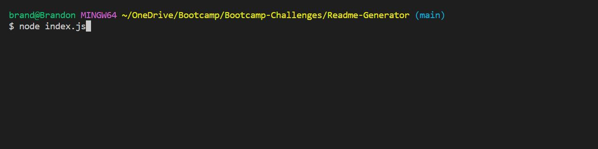
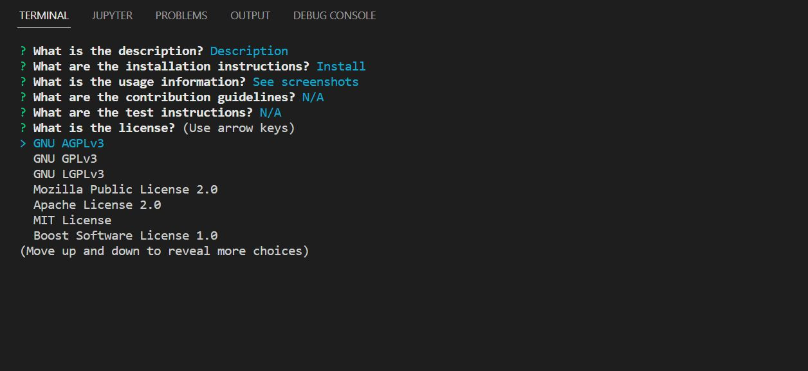

# README.md Generator

## Description

- This program will generate a README.md file dynamically based on a series of prompted user inputs.
- This program will significantly reduce the amount of time taken to initiate a README.md file for your project.
- All required sections of a typical professional README.md file will be generated.
- License badge and information are also dynamically generated based on user selection.

## Table of content

- [Installation](#installation)
- [Usage](#usage)
- [Credits](#credits)
- [License](#license)

## Installation

- Before you start, do "npm install" to install the Inquirer npm package.

## Usage

- Link to the demo video: [https://app.castify.com/view/0ac8fe37-29c2-4951-b071-3a53192047e0](https://app.castify.com/view/0ac8fe37-29c2-4951-b071-3a53192047e0)

- Please see sample README.md file generated with this program in the "sample_readme" of this repo.

- In the terminal, type "node index.js" to kick off the program.

  

- Answer questions one by one when prompted.

  

- When done, a new README.md file will be generated with all the information you just provided!

## Credits

- Author's Github Profile: [https://github.com/BranBao1995?tab=repositories](https://github.com/BranBao1995?tab=repositories)

## License 

The MIT License

Copyright (c) [2022] [Hongdong Bao]

Permission is hereby granted, free of charge, to any person obtaining a copy
of this software and associated documentation files (the "Software"), to deal
in the Software without restriction, including without limitation the rights
to use, copy, modify, merge, publish, distribute, sublicense, and/or sell
copies of the Software, and to permit persons to whom the Software is
furnished to do so, subject to the following conditions:

The above copyright notice and this permission notice shall be included in all
copies or substantial portions of the Software.

THE SOFTWARE IS PROVIDED "AS IS", WITHOUT WARRANTY OF ANY KIND, EXPRESS OR
IMPLIED, INCLUDING BUT NOT LIMITED TO THE WARRANTIES OF MERCHANTABILITY,
FITNESS FOR A PARTICULAR PURPOSE AND NONINFRINGEMENT. IN NO EVENT SHALL THE
AUTHORS OR COPYRIGHT HOLDERS BE LIABLE FOR ANY CLAIM, DAMAGES OR OTHER
LIABILITY, WHETHER IN AN ACTION OF CONTRACT, TORT OR OTHERWISE, ARISING FROM,
OUT OF OR IN CONNECTION WITH THE SOFTWARE OR THE USE OR OTHER DEALINGS IN THE
SOFTWARE.
